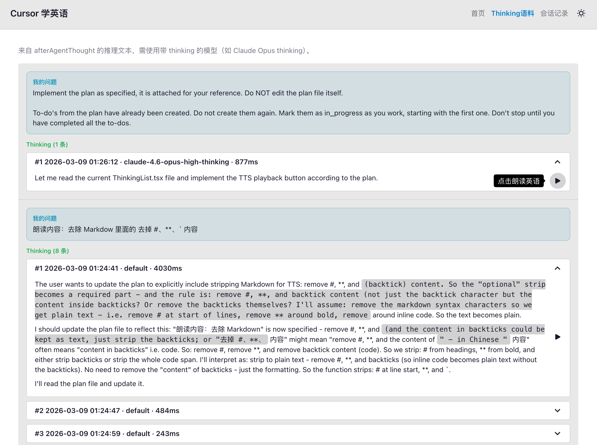
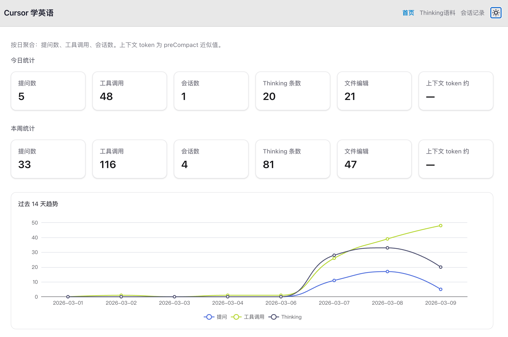
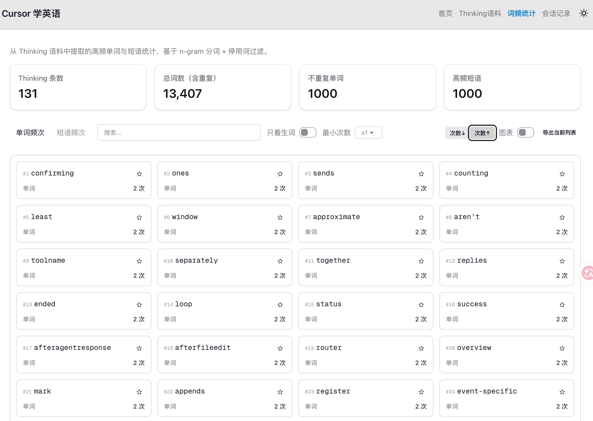
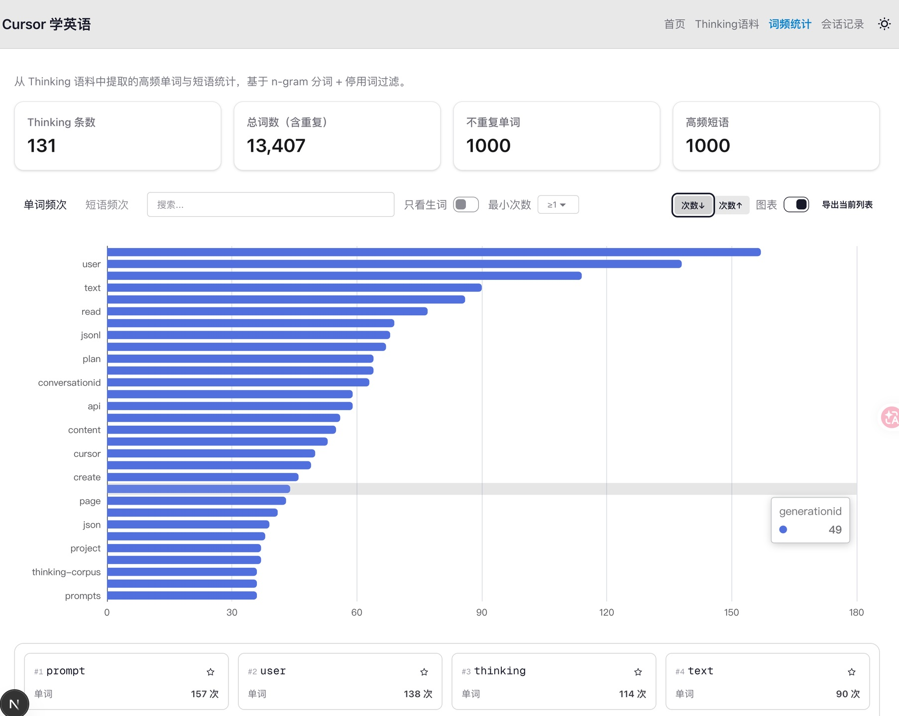
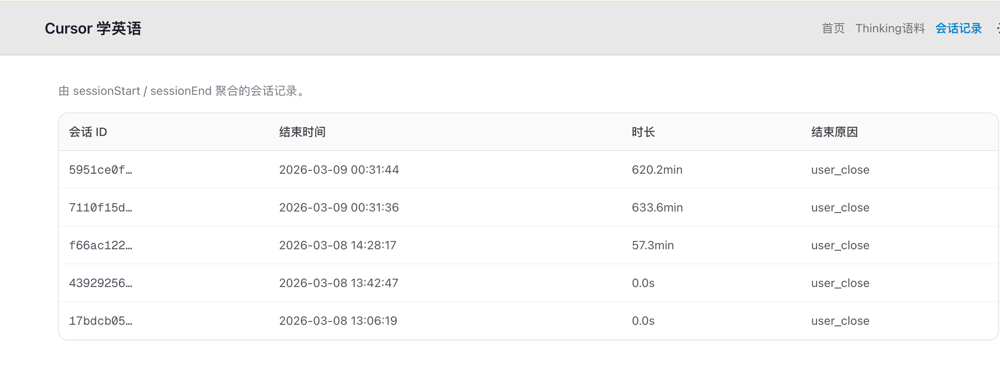

# cursor-thinking-stat

本项目是一个基于 Cursor Hooks 的数据采集与可视化工具，自动收集AI 的思考推理过程，并提供 Web 前端页面进行可视化展示，梳理高频单词短语等信息，提升英语阅读能力。

---

## 预览视频
[B站视频-使用录屏](https://www.bilibili.com/video/BV1hMNFz1Emx/?spm_id_from=333.1007.top_right_bar_window_history.content.click&vd_source=e136dbd0b0286f6018f6e08b5fffa4b4)
## 预览图片







## Cursor Hooks 配置

采集依赖 Cursor 的 **用户级 Hooks**，配置在 `~/.cursor/` 下。

### 1. 目录与脚本

在用户目录下建立脚本与配置（可从本仓库复制）：

```text
~/.cursor/
├── hooks.json                   # 见下方配置内容
└── scripts/
    ├── capture-event.mjs        # 统一事件写入 cursor-events.jsonl
    ├── capture-prompt.mjs       # 用户提问写入 prompt-corpus.jsonl
    ├── capture-thinking.mjs     # Thinking 写入 thinking-corpus.jsonl
    ├── capture-response-to-txt.mjs
    └── test.sh
```

用户级 Hooks 的**工作目录**为 `~/.cursor/`，因此 `hooks.json` 中的命令使用 `./scripts/xxx.mjs` 即可。

> **重要：改了仓库里的采集脚本，必须重新安装到 `~/.cursor/`**
>
> Cursor 实际执行的是 `~/.cursor/scripts/*.mjs` 的**副本**，不是本仓库 `scripts/` 下的源文件。  
> 修改 `scripts/capture-*.mjs`、`thinking-dedupe.mjs`、`jsonl-daily.mjs`、`default-paths.mjs` 或 `hooks/hooks.json` 后，请立刻再跑一次：
>
> ```bash
> bash scripts/setup-cursor-hooks.sh
> ```
>
> 也可在 Cursor 里用任务 **「新用户一键配置」**（会再次复制脚本）。只改仓库、不重装时，去重/路径等修复**不会生效**，语料里还可能继续出现重复 Thinking。

### 2. hooks.json 配置示例

```json
{
  "version": 1,
  "hooks": {
    "beforeSubmitPrompt": [
      { "command": "node ./scripts/capture-prompt.mjs" },
      { "command": "node ./scripts/capture-event.mjs" }
    ],
    "afterAgentResponse": [{ "command": "node ./scripts/capture-event.mjs" }],
    "afterAgentThought": [
      { "command": "node ./scripts/capture-thinking.mjs" },
      { "command": "node ./scripts/capture-event.mjs" }
    ],
    "postToolUse": [{ "command": "node ./scripts/capture-event.mjs" }],
    "postToolUseFailure": [{ "command": "node ./scripts/capture-event.mjs" }],
    "sessionStart": [{ "command": "node ./scripts/capture-event.mjs" }],
    "sessionEnd": [{ "command": "node ./scripts/capture-event.mjs" }],
    "subagentStart": [{ "command": "node ./scripts/capture-event.mjs" }],
    "subagentStop": [{ "command": "node ./scripts/capture-event.mjs" }],
    "stop": [{ "command": "node ./scripts/capture-event.mjs" }],
    "preCompact": [{ "command": "node ./scripts/capture-event.mjs" }],
    "afterFileEdit": [{ "command": "node ./scripts/capture-event.mjs" }]
  }
}
```

### 3. 数据输出路径


| 文件                        | 来源                     | 说明                                                   |
| ------------------------- | ---------------------- | ---------------------------------------------------- |
| `~/projects/cursor-learn-english/data/thinking-corpus.jsonl` | `capture-thinking.mjs` | 每行一条 Thinking 记录（text、timestamp、model、duration_ms 等） |
| `~/projects/cursor-learn-english/data/prompt-corpus.jsonl`   | `capture-prompt.mjs`   | 每行一条用户提问（prompt、timestamp、conversation_id） |
| `~/projects/cursor-learn-english/data/cursor-events.jsonl`   | `capture-event.mjs`    | 每行一条事件（event_type、timestamp、conversation_id 及事件字段）   |


可通过环境变量覆盖路径（Hooks 与 Web 使用**同一套变量名**，见下表）。Web 端在项目根目录复制 [`.env.local.example`](.env.local.example) 为 `.env.local` 后按需取消注释；Hooks 脚本从进程环境读取，可在 shell 配置中 `export`，或确保与 `.env.local` 指向相同绝对路径。

#### 路径变量总览

| 数据 | 默认文件 | 变量（优先级从高到低） | 读/写方 |
|------|----------|------------------------|---------|
| 事件 | `~/projects/cursor-learn-english/data/cursor-events.jsonl` | `EVENTS_JSONL_PATH` → `CURSOR_EVENTS_PATH` | `capture-event.mjs`、Web API |
| Thinking 语料 | `~/projects/cursor-learn-english/data/thinking-corpus.jsonl` | `CORPUS_JSONL_PATH` → `THINKING_CORPUS_PATH` | `capture-thinking.mjs`、Web API |
| 用户提问 | `~/projects/cursor-learn-english/data/prompt-corpus.jsonl` | `PROMPT_CORPUS_PATH` | `capture-prompt.mjs`、Web API |
| 关键词（可选） | — | `KEYWORD_JSONL_PATH` | 仅 Web `/api/keyword`；未配置时返回 503 |

#### Thinking 语料：`CORPUS_*` ↔ `THINKING_*` 对照

两套名称指向**同一文件**，任选其一即可；若同时设置，以 `CORPUS_JSONL_PATH` 为准。

| 变量 | 常见来源 | 说明 |
|------|----------|------|
| `CORPUS_JSONL_PATH` | Web / 新版文档 | Next.js（`lib/thinking.ts`）与 `capture-thinking.mjs` **优先**使用 |
| `THINKING_CORPUS_PATH` | Hooks / 旧版 README | 与上式等价；`capture-response-to-txt.mjs` 仅识别此名 |

#### 事件文件：`EVENTS_*` ↔ `CURSOR_*` 对照

| 变量 | 常见来源 | 说明 |
|------|----------|------|
| `EVENTS_JSONL_PATH` | Web / 新版文档 | Next.js（`lib/events.ts`）与 `capture-event.mjs` **优先**使用 |
| `CURSOR_EVENTS_PATH` | Hooks / 旧版 README | 与上式等价，次优先 |

> **对齐建议**：本地开发时在 `.env.local` 中写 `CORPUS_JSONL_PATH` 与 `EVENTS_JSONL_PATH`；若 Hooks 与 Web 不同机或不同用户，请在 Hooks 运行环境中 export **相同绝对路径**，避免仪表盘读不到采集文件。

#### 按日切分、保留与清理（#5 中期）

默认开启按日写入：在配置的**基路径**旁生成 `*-YYYY-MM-DD.jsonl` 分片（例如 `data/thinking-corpus-2026-06-02.jsonl`），避免单文件无限增大。读侧会合并**旧版单文件**（若仍存在）与所有分片。可用环境变量 `CURSOR_DASHBOARD_DATA_DIR` 覆盖整个数据目录。

| 变量 | 默认 | 说明 |
|------|------|------|
| `JSONL_DAILY_SPLIT` | 开启 | 设为 `0` 或 `false` 时采集仍只追加到基路径单文件 |
| `JSONL_RETENTION_DAYS` | `90` | 自动删除早于该天数的**分片**；`0` 表示不自动删 |
| `MAX_JSONL_BYTES` | `52428800`（50MB） | 单分片超过此大小时 API 只读尾部（见 `lib/jsonl.ts`） |
| `MAX_JSONL_TAIL_LINES` | `100000` | 尾部截断时最多保留行数 |

采集脚本在追加时会至多每 24 小时触发一次 TTL 清理；也可手动执行：

```bash
node scripts/prune-jsonl.mjs
```

旧版家目录下的 `~/thinking-corpus.jsonl` 等单文件不会被 TTL 删除，可在确认分片已包含历史数据后自行归档或删除。

### 4. 依赖与运行

- 脚本需 **Node.js**（无 npm 依赖）。
- Web 端：在项目根目录执行 `npm install` 后 `npm run dev`，浏览器打开仪表盘。路径覆盖见上文对照表，亦可复制 `.env.local.example` → `.env.local`。Thinking 页「我的问题」依赖 `data/prompt-corpus.jsonl`（或 `PROMPT_CORPUS_PATH`），需确保 `beforeSubmitPrompt` 已挂载 `capture-prompt.mjs`。
- 可选关键词页：设置 `KEYWORD_JSONL_PATH` 指向外部 keyword JSONL；未配置时 `/api/keyword` 返回 503 而非 500。

更多事件字段说明见 [hooks.md](hooks.md)。

### 5. 终端任务使用指引

本仓库在 `.vscode/tasks.json` 中配置了可在 Cursor 中直接运行的任务。**终端 → 运行任务...** 中可选：

| 任务 | 说明 |
|------|------|
| **新用户一键配置** | 执行 `npm install`，并将 Hooks 脚本与 `hooks.json` 复制到 `~/.cursor/`（首次使用）。 |
| **更新 Cursor Hooks（改脚本后必跑）** | 仅同步 `scripts/*.mjs` 与 `hooks.json` 到 `~/.cursor/`。**改采集脚本后务必再跑**，否则 Cursor 仍用旧副本。 |
| **本地访问：启动 dev（仅本机）** | 启动开发服务，仅本机浏览器访问 http://localhost:3000 。 |
| **WSL/宿主机访问：启动 dev** | 启动开发服务并监听 `0.0.0.0`，宿主机浏览器也可访问 http://localhost:3000 。 |

也可手动执行：`bash scripts/setup-cursor-hooks.sh`（改采集脚本后务必再执行，见上文「重要」说明）。

---

## 项目结构

```
thinking-get-hook/
├── .cursor-plugin/
│   └── plugin.json              # Cursor Plugin 清单（可选，用于插件形式分发）
├── app/
│   ├── layout.tsx
│   ├── page.tsx                 # 仪表盘首页
│   ├── globals.css
│   ├── api/
│   │   ├── events/route.ts      # GET 事件聚合（按日/类型）
│   │   ├── thinking/route.ts    # GET Thinking 语料分页
│   │   ├── vocab/route.ts       # GET 词频统计
│   │   └── sessions/route.ts    # GET 会话列表
│   ├── thinking/page.tsx        # Thinking 语料页
│   ├── vocab/page.tsx           # 词频统计页
│   └── sessions/page.tsx       # 会话列表页
├── components/
│   ├── ThinkingList.tsx         # Thinking 列表（Markdown 渲染）
│   ├── VocabStats.tsx           # 词频图表与表格
│   └── SessionTable.tsx         # 会话表格
├── lib/
│   ├── events.ts                # 读 cursor-events.jsonl、按日聚合
│   ├── thinking.ts              # 读 thinking-corpus.jsonl、分页
│   └── vocab.ts                 # 词频聚合
├── .vscode/
│   └── tasks.json               # Cursor/VS Code 一键任务
├── hooks/
│   └── hooks.json               # 本仓库内 Hooks 配置（可复制到 ~/.cursor）
├── scripts/
│   ├── capture-event.mjs        # 统一事件采集 → cursor-events.jsonl
│   ├── capture-prompt.mjs       # 用户提问采集 → prompt-corpus.jsonl
│   ├── capture-thinking.mjs     # Thinking 采集 → thinking-corpus.jsonl
│   ├── capture-response-to-txt.mjs
│   ├── setup-cursor-hooks.sh    # 一键安装 Hooks 到 ~/.cursor
│   └── test.sh
├── hooks.md                     # Hooks 事件说明文档
├── package.json
├── next.config.ts
└── README.md
```

## 参考文档

[https://cursor.com/cn/docs/hooks#hook-5](https://cursor.com/cn/docs/hooks#hook-5)
